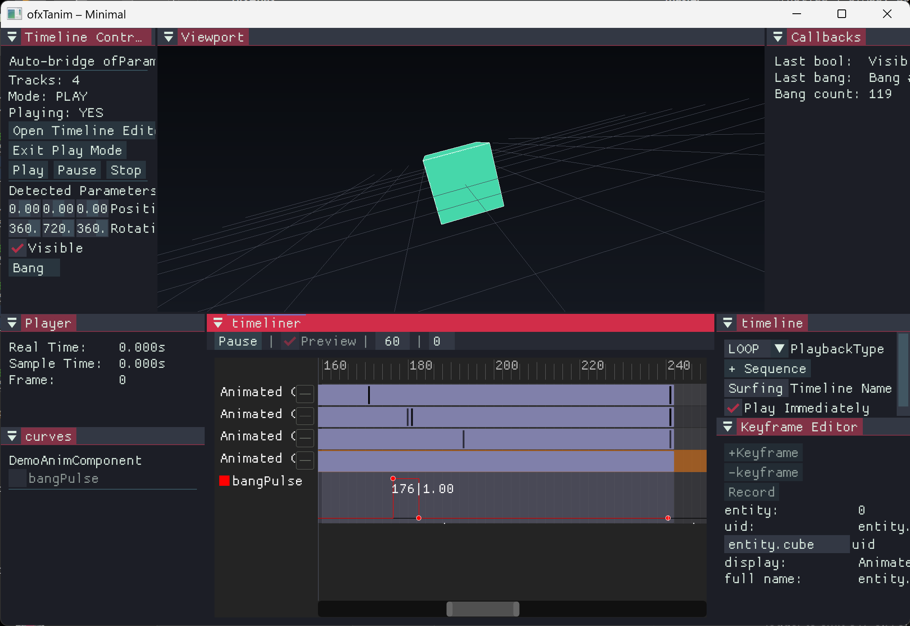

# ofxTanim

Bezier-curve keyframe timeline animation for openFrameworks ECS apps, integrated with the shared [ofxEnTTInspector](../ofxEnTTInspector) reflection system.

Based on [hegworks/tanim](https://github.com/hegworks/tanim).

---



---

## Dependencies

| Addon | Why |
|-------|-----|
| `ofxEnTT` | entt::registry |
| `ofxImGui` | Curve editor and UI |
| `ofxEnTTInspector` | Shared reflection (`registerProperties`, `PinDataType`, `ReflectedProperty`) |

> **Removed dependencies:** `visit_struct`, `nlohmann/json` (bundled copy). JSON serialization is now via `ofJSON` (OF's built-in nlohmann). Reflection is via `ofxEnTTInspector`.

---

## Migration from TANIM\_REFLECT

**Old approach** (removed):
```cpp
// At global scope in a header:
TANIM_REFLECT(my_comp, x, y, z);

// At startup:
tanim::RegisterComponent<my_comp>();
```

**New approach** — one specialization serves Inspector, Tanim, and StateCollector:
```cpp
// In my_comp_inspector.h (include wherever these tools are used):
#pragma once
#include "ComponentInspector.h"
#include "my_comp.h"

template<>
inline void inspector::registerProperties(my_comp& c, inspector::ComponentInspector& ci) {
    ci.addProperty("x", &c.x, -100.f, 100.f);
    ci.addProperty("y", &c.y, -100.f, 100.f);
    ci.addProperty("z", &c.z, -100.f, 100.f);
}

// At startup (explicit name recommended for JSON stability):
tanim::RegisterComponent<my_comp>("my_comp");
```

The `structName` parameter is stored in serialized JSON. It should remain **stable across refactors** — if you rename the struct, also update the string, or existing saved timelines will not load correctly.

---

## Quick start

```cpp
#include "ofxTanim.h"
#include "my_comp_inspector.h"   // specializes inspector::registerProperties<my_comp>

void ofApp::setup() {
    tanim::Init();
    tanim::RegisterComponent<my_comp>("my_comp");
}

void ofApp::update() {
    // Advance all playing timelines:
    tanim::UpdateTimeline(registry, entityDatas, timelineData, componentData, ofGetLastFrameTime());
}

void ofApp::draw() {
    // Inside ImGui frame:
    tanim::Draw();          // draws the curve editor window
    tanim::UpdateEditor(ofGetLastFrameTime());
}

// When you want to open the editor for a specific entity:
tanim::OpenForEditing(registry, entityDatas, timelineData, componentData);
```

---

## Supported field types

| PinDataType | Curves | Notes |
|-------------|--------|-------|
| `Float` | 1 | Smooth Bezier |
| `Int` | 1 | Linear, integer-snapped |
| `Bool` | 1 | Constant (step) |
| `Vec2` | 2 | X, Y |
| `Vec3` | 3 | X, Y, Z |
| `Vec4` | 4 | X, Y, Z, W |
| `Quat` | 5 | W, X, Y, Z + Spins curve |
| `Color` | 4 | R, G, B, A normalized 0–1 in curves |

`String`, `Trigger`, and `Any` are not animatable and will be silently skipped.

---

## Serialization

```cpp
// Save:
std::string json = tanim::Serialize(timelineData);
ofSaveFile("timeline.json", json);

// Load:
std::string json = ofLoadFileAsString("timeline.json");
tanim::Deserialize(timelineData, json);
```

Serialized format version 2 (unchanged from original). JSON keys use the explicit struct name passed to `RegisterComponent`.

---

## API reference

```cpp
tanim::Init();
tanim::RegisterComponent<T>("struct_name");
tanim::Draw();
tanim::UpdateEditor(dt);
tanim::OpenForEditing(registry, entityDatas, tdata, cdata);
tanim::CloseEditor();

tanim::EnterPlayMode();
tanim::StartTimeline(tdata, cdata);
tanim::UpdateTimeline(registry, entityDatas, tdata, cdata, dt);
tanim::StopTimeline(cdata);
tanim::ExitPlayMode();

tanim::Play(cdata);
tanim::Pause(cdata);
tanim::Stop(cdata);
bool playing = tanim::IsPlaying(cdata);

std::string json = tanim::Serialize(tdata);
tanim::Deserialize(tdata, json);
```

---

## ofxKit integration (src/kit/)

`src/kit/` ships **ofxAnimationKit** — glue for running Tanim inside an
[ofxKit](../ofxKit) runtime (like `ofxBulletKit.h` inside ofxBullet). The
sources are guarded by `__has_include("Runtime.h")` and compile to empty
translation units unless ofxKit is in `addons.make`, so standalone ofxTanim
apps are unaffected.

```cpp
#include "kit/ofxAnimationKit.h"

ofxAnimationKit::AnimationKit m_animKit;

void ofApp::setup() {
    m_animKit.registerWith(ofkitty::runtime());
    m_animKit.bridge().bindRegistry(ofkitty::runtime().registry());
    m_animKit.bridge().registerUid("entity.cube", myEntity);
}
```

`AnimationBridge` owns the uid → `entt::entity` map and supplies
`tanim::FindEntityOfUID` (plus `LogError` / `LogInfo`) so Tanim can resolve
animated entities from timeline data. Kit apps must **not** define those
overrides themselves.

Each frame (after ImGui `NewFrame`, before `EndFrame`):

```cpp
tanim::UpdateEditor(ofGetLastFrameTime());
```

Register animatable components with `tanim::RegisterComponent<T>()` and wire
`inspector::registerProperties<T>` in ofxEnTTInspector before opening a
timeline. `registerWith()` also registers a dockable "Timeline" window
(placeholder host; `tanim::Draw()` hosting is a future revision).
